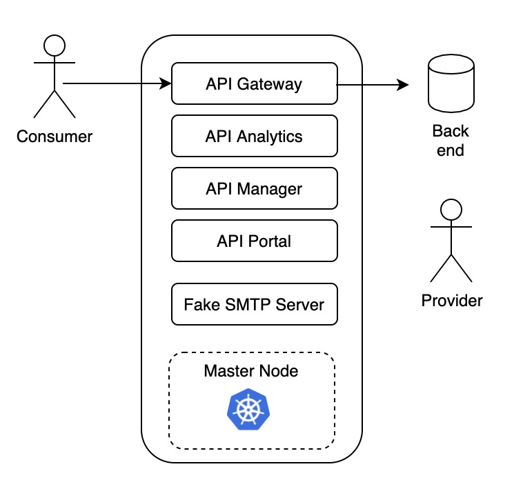

APICv2018ltsInstallLinuxRedHat
===========================

# About 
`APICv2018ltsInstallLinuxRedHat` provide tools and scripts to install and configure API Connect v2018 on a single kubernetes master node on RedHat Linux 7.x (A single VM)

<p align="center">
  
</p>

# Installing
Download the latest release on the home repository on your operating system where you want install API Connect v2018.

# Requirement

The first limiting factor is the ability to meet the hardware requirements for the 4 API Connect components. Looking at the current maintenance level of APIC: 2018.4.1.10, current minimum hardware requirements are 12 cores of CPU power and 48GB of RAM. On top of that 532GB of disk space is required.

https://www.ibm.com/support/knowledgecenter/SSMNED_2018/com.ibm.apic.install.doc/overview_apimgmt_requirements.html

| Component  | vCPU  | RAM  | HDD |
|:------------- |:---------------:| -------------:| -------------:|
| Gateway      | 4 |  8 |  32 |
| Manager      | 4 |  16 |  250 |
| Analytics    | 2 |  16 |  200 |
| Portal      | 2 |  8 |  50 |
| Kube Master / node      | 4 |  4 |  20 |
| Total      | 16 |  52 |  552 |

Typicaly works fine on a VM with :

- Redhat Linux 7.4
- 16 vCPU
- 64 Gb of RAM
- 100 Gb of HDD

Other requirement :

- sudo user (to install kubernetes + docker)

# Usage

- (optional) Create a sudo user for kubernetes client admin.
```
    useradd kadmin
    passwd kadmin 

    # Add kadmin as sudo user
    echo "kadmin       ALL=(ALL)       ALL" >> /etc/sudoers

    (Optional)
    sudo yum install git --assumeyes
```

- Clone github repository
```
    git clone https://github.com/fdut/APICv2018ltsInstallLinuxRedHat 
```

- Donwload kubernetes images from IBM Support [here](https://www.ibm.com/support/fixcentral/swg/identifyFixes?query.parent=ibm~WebSphere&query.product=ibm~WebSphere~IBM%20API%20Connect&query.release=2018.4.1.9&query.platform=Linux) in the directory you define in the **envfile** : `sources`

```
A list o file for 2018.4.1.10 version.

- portal-images-kubernetes_lts_v2018.4.1.10 
- management-images-kubernetes_lts_v2018.4.1.10 
- idg_dk20184110.lts.prod 
- dpm20184110.lts 
- apicup-linux_lts_v2018.4.1.10 
- analytics-images-kubernetes_lts_v2018.4.1.10  

7 files approximaly 4,2 GB

SFTP download recommended
```


- Copy *envfile.template* to *envfile*

  ``` cp envfile.template envfile```

- Update **envfile** with your own value
- Launch `prepareos.sh` to install all operating system requirement for next step.


# Commands
<!-- commands -->
##  Prepare and Install Kubernetes

* `make master` : checkprereq installk8s initk8s installHelm getk8sstatus

##  Prepare for API Connect

* `make prepapic` :  ingress storage registry smtp getk8sstatus

##  Deploy or Upgrade APIC

* `make deploy` : checkReady installapicup upload buildYaml deployAPIC getk8sstatus

##  Configure APIC (Add Gateway, Analytics, Portal services and deploy a API sample) 

* `make configureAPIC` : addTopology  loadAssets createApp


##  Full install and configuration

* `make full` : master prepapic deploy configureAPIC

# Optional

## Setting the target namespace

The `default` namespace for the deployment will be targeted by default. If your deployment makes use of an alternative namespace then you will need to set this in the relevant context of your kubeconfig file.
Your can either edit your kubeconfig file directly and add the namespace property with the desired value to the relevant context.
Alternatively you can set the namespace for the current context using the following command (where < namespace > is the value you want to set the namespace to):
```
kubectl config set "contexts."`kubectl config current-context`".namespace" < namespace >
```
You can view all contexts and their configured namespace with the command:
```
kubectl config get-contexts